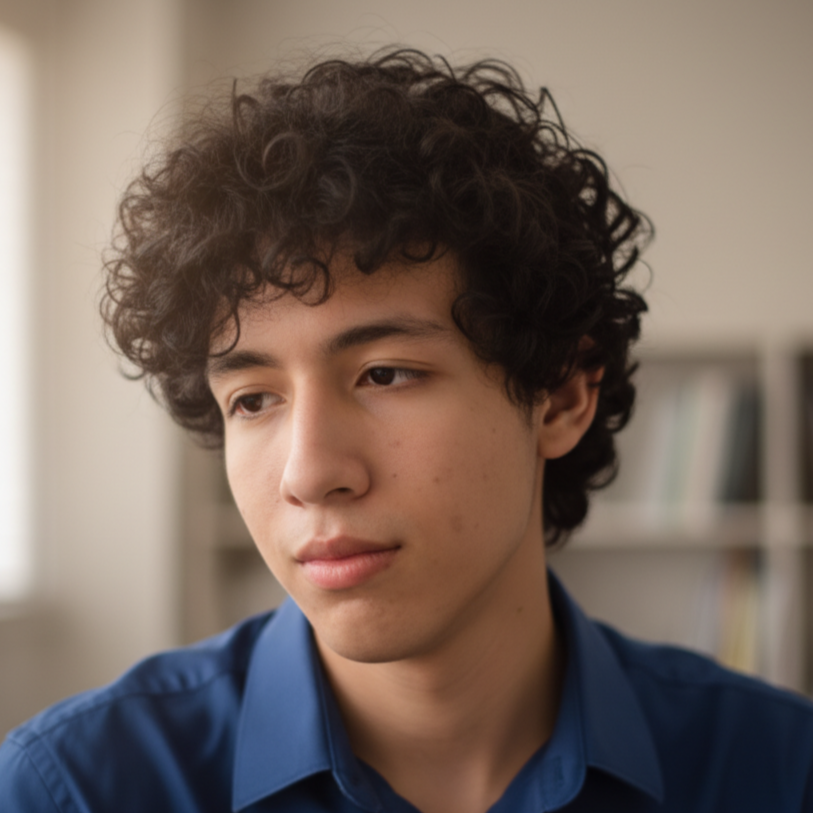

# 10 Gatos Amarillos

--------------------------------------------------

# Integrante: Daniel Fernando Díaz (Líder)

## 👤 Información Personal
 *  **Rol en el equipo:** Artista 2D / Animador
 *  **Ubicación:** Putumayo, Colombia
 *  **Edad:** 21 años

## 🚀 Perfil Profesional
Estudiante de la **UNAD** con un fuerte interés en el desarrollo visual de videojuegos.

Tengo experiencia práctica como **diseñador y animador (frame a frame)**, además de conocimientos en herramientas de edición de video. Aunque mi enfoque principal es el arte, cuento con bases "novatas" pero sólidas en programación de videojuegos 2D, lo que me permite entender mejor cómo integrar los gráficos en el motor Unity.

Me considero una persona creativa y dispuesta a aprender, con el objetivo de aportar calidad visual y dinamismo al prototipo que desarrollaremos.

## 🍽️ Comida Favorita
¡Nada mejor para programar y diseñar que estar bien alimentado!

 

--------------------------------------------------

<h1>Juan Jose Rios<h1>

 Mi nombre es Juan José Ríos Cifuentes, estudiante de Ingeniería Multimedia en la Universidad Nacional Abierta y a Distancia. Vivo en Florencia, Caquetá, trabajo en una universidad como diseñador grafico por lo que eso me apasiona muchisimo, el arte de crear publicidad, tambien me gusta mucho la pizza y me interesa el desarrollo de videojuegos, me considero una persona responsable, creativa y comprometida con el trabajo.

--------------------------------------------------

